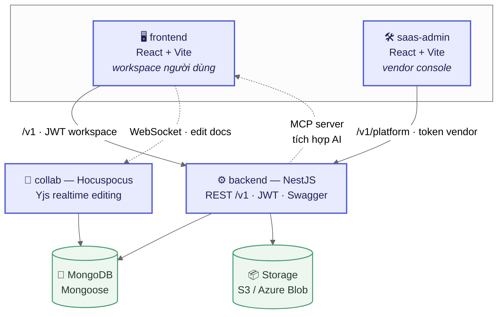
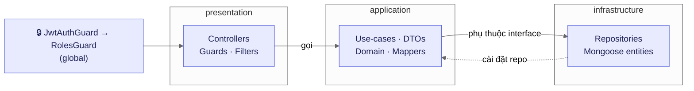
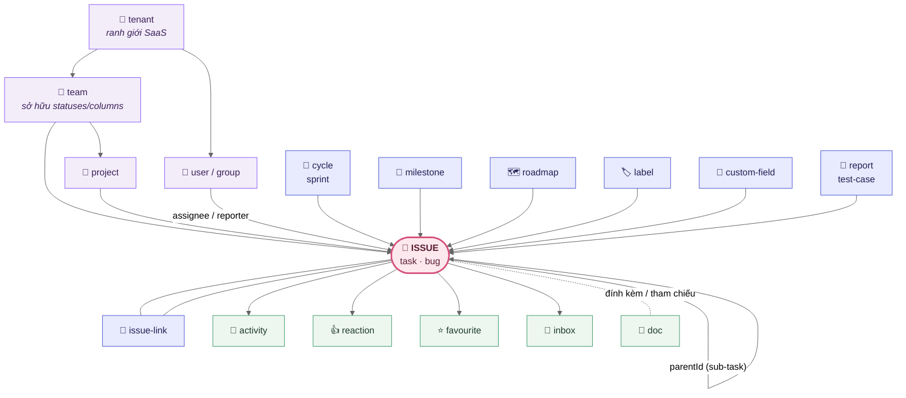
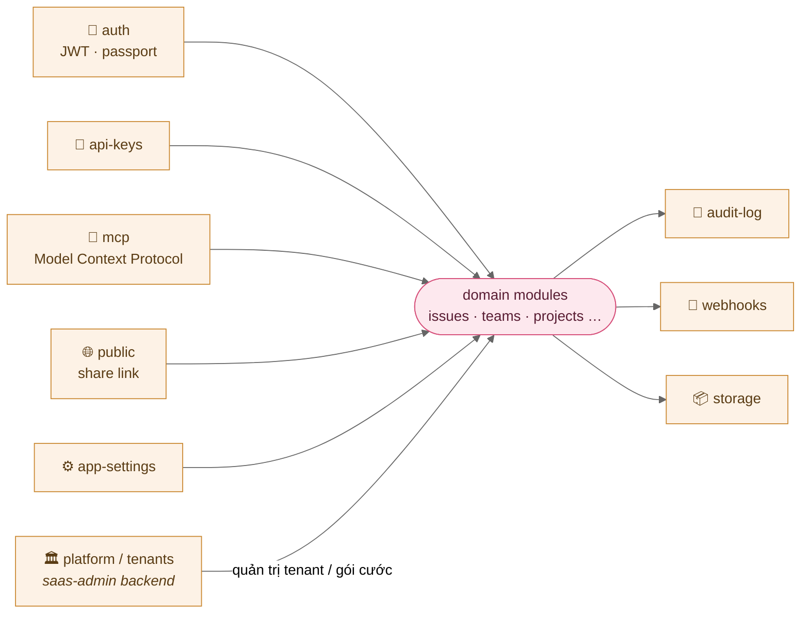

# Product-OS — Bản đồ quan hệ module

*Monorepo · 4 ứng dụng · backend NestJS (DDD) + MongoDB · frontend & saas-admin (React/Vite) · collab (Yjs)*

---

## 1 · Toàn cảnh hệ thống — 4 ứng dụng

Bốn tiến trình chạy độc lập. `frontend` và `saas-admin` cùng gọi một backend nhưng qua **hai không gian token tách biệt** — JWT workspace không chạm được `/v1/platform`.

---

## 2 · Backend — kiến trúc DDD 3 lớp

Mỗi domain module (`issues`, `teams`, `projects`…) đều có đủ 3 lát cắt này. `presentation` mount route dưới `/v1/<prefix>`.

---

## 3 · Quan hệ domain — `issue` là trung tâm

`issue` là một collection **đa hình** (`kind` = task / bug / …). Hầu hết module khác gắn vào nó qua khóa ngoại (`teamId`, `projectId`, `cycleId`, `roadmapId`, `parentId`, `assigneeId`, `labelKeys`, `reportId`).

**Đọc sơ đồ:** tổ chức (tím) chứa mọi thứ → `issue` (hồng, trung tâm) → các chiều lập kế hoạch (xanh dương) phân loại issue → lớp cộng tác (xanh lá) phản ứng theo mỗi issue.

---

## 4 · Nền tảng & tích hợp — bao quanh domain

---

## 5 · Ánh xạ FE ⇄ BE

Mỗi feature ở `frontend/src/features/` gần như 1-1 với một domain module backend.

| Nhóm | frontend features | backend modules |
|---|---|---|
| **Nghiệp vụ** | issues · bugs · tasks · cycles · milestones · roadmaps · projects · reports | issues · bugs · tasks · cycles · milestones · roadmaps · projects · reports |
| **Tổ chức** | teams · groups · users · my-team · account | teams · groups · users |
| **Lập kế hoạch** | planning · labels · custom-fields | issues (labels/customFields) |
| **Cộng tác** | docs · inbox · activity · reactions · favourites · uploads | docs · inbox · activity · reactions · favourites · storage |
| **Nền tảng** | auth · settings · admin · api-keys · audit-log · mcp · public | auth · app-settings · platform · api-keys · audit-log · mcp · public |
| **SaaS admin** | *(saas-admin)* overview · plans · subscriptions · tenants · usage | platform · tenants · webhooks |

---

Sinh ra từ đọc mã nguồn thực tế: <code>backend/src/{presentation,application,infrastructure}</code>, <code>frontend/src/features</code>, <code>saas-admin/src/features</code>, <code>collab/src</code>.

